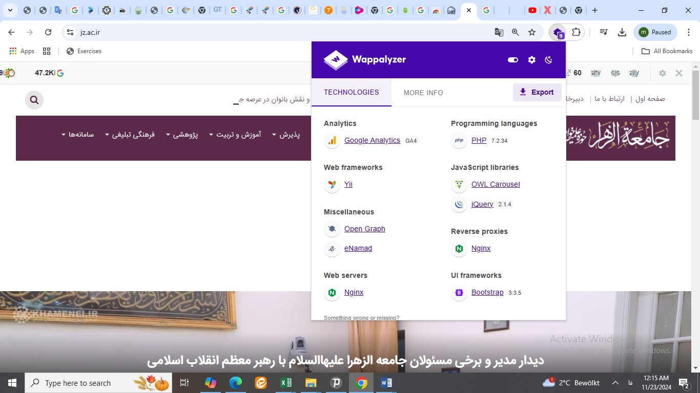
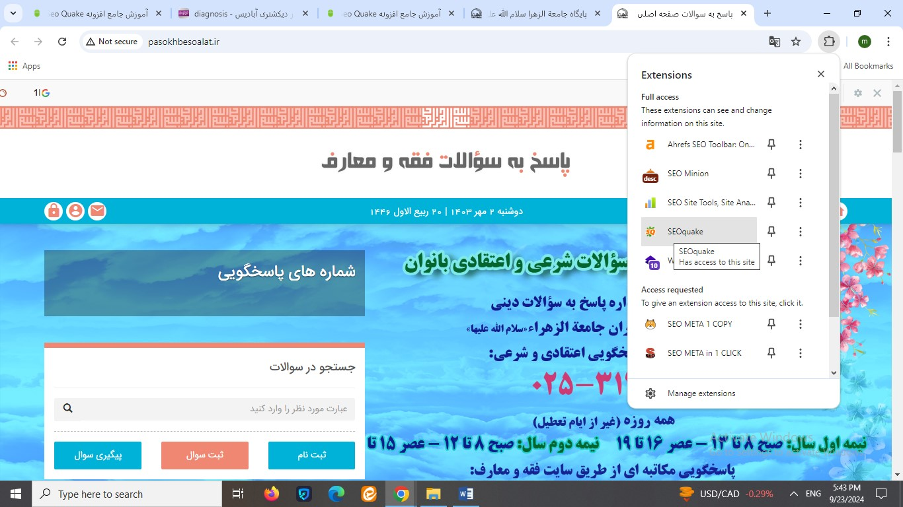
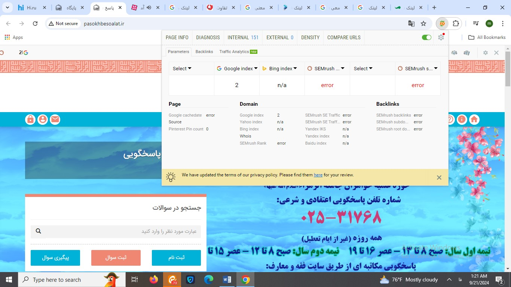
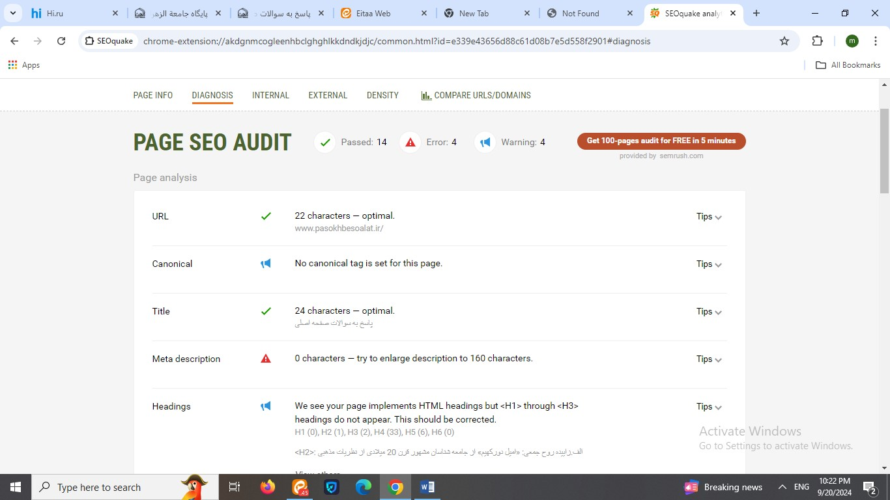
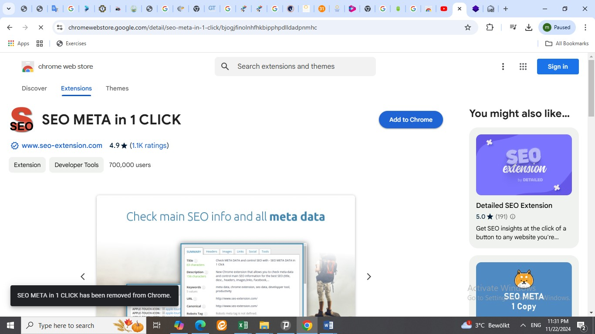
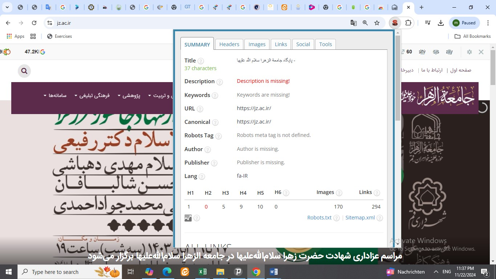
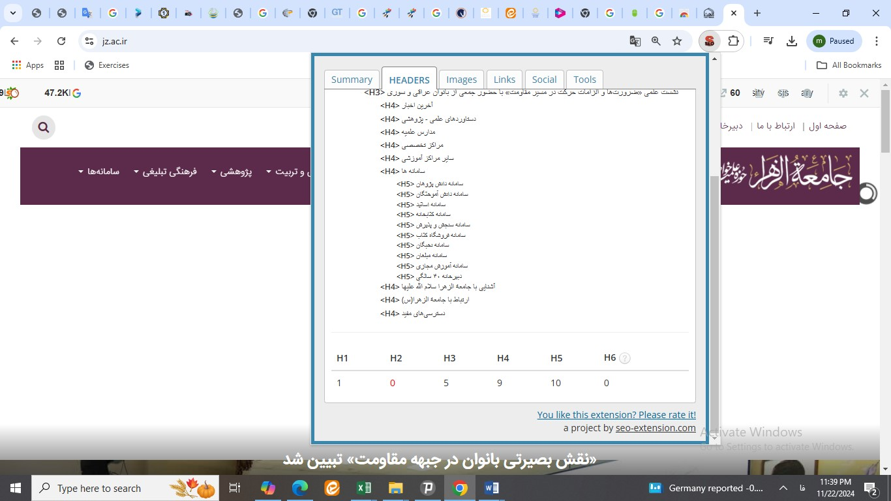
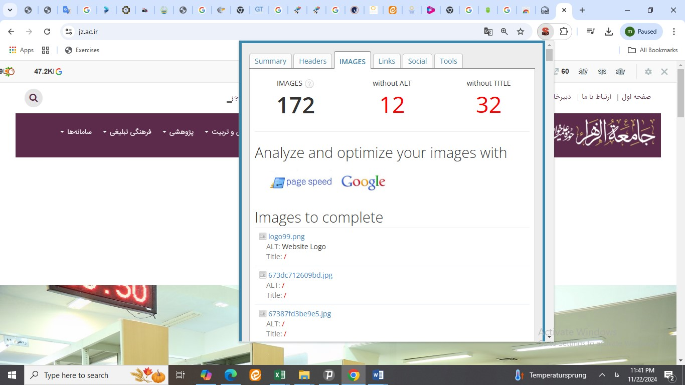
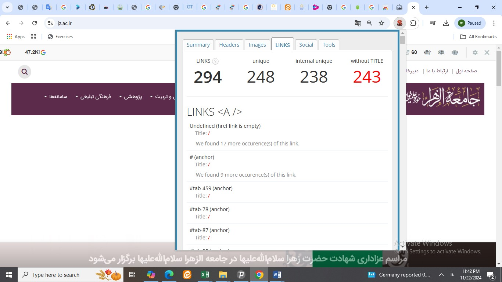
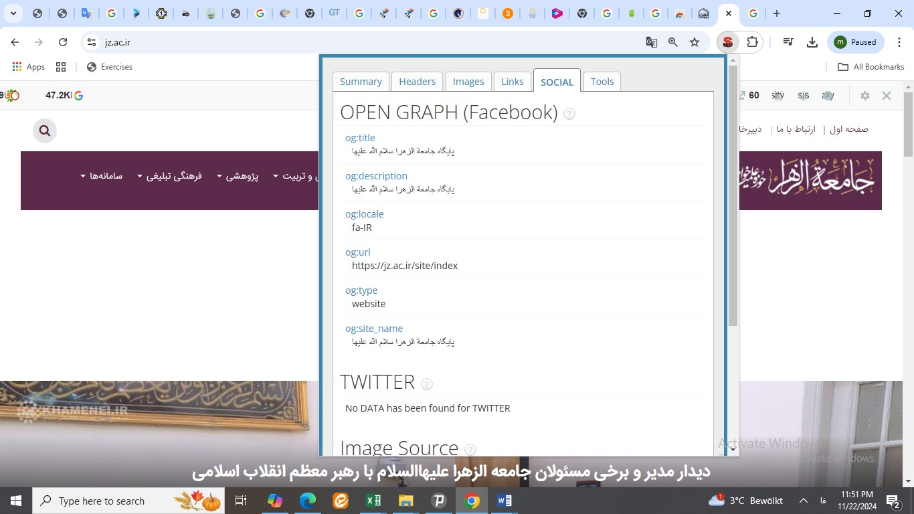

# SEO-BOOK

# مقدمه

هر فرد یا سازمانی که خدمات محتوایی یا فروشگاهی از طریق سایت ارائه میدهد، نیازمند آن است که از عملکرد سایت خود آگاهی کافی داشته باشید.
آنالیز سایت مشخص می کند که تا چه اندازه وب سایت ما پتانسیل رسیدن به اهداف ترافیکی سایت رادارد. و اگر در این زمینه ضعیف عمل کرده است، چطور عملکرد آن را قوت ببخشد.
تحلیل کیفی و کمی  فعالیت سایر رقبا در جهت کسب پیشرفت مستمر، یک نیاز قطعی است. این کار در نهایت به رضایت مخاطبان فعلی و بالقوه ما خواهد رسید و از طرف دیگر شما را به اهداف مان نزدیکتر می سازد. 
در این نوشتار سعی کرده ایم، مفهوم آنالیز، و نحوه کار با ابزارهای آنالیز و تحلیل سایت را توضیح دهیم. 

**منظور از آنالیز سایت چیست؟**

آنالیز سایت فرایندی است که در آن سایت را از نظر سئو تحلیل و بررسی کرده تا بفهمیم آیا سایت به خوبی برای موتورهای جستجو بهینه‌سازی شده یا نه. این فرایند شامل بررسی سئوی داخلی سایت، مباحث تکنیکال سایت و سئو خارجی آن است. در واقع برای آنالیز سایت باید کلیه جنبه‌های سئو مثل عنوان مطالب و تگ‌های متا، کلمات کلیدی هدف، سرعت سایت، فایل سایت مپ، لینک‌سازی داخلی و لینک‌سازی خارجی را بررسی کرده و ببینید در کدام قسمت‌ها به خوبی کار نکرده‌اید و کدام فعالیت‌ها را می‌توانید بهبود دهید.

**هدف از آنالیز سایت چیست؟**
آنالیز سایت این فرصت را در اختیار  ما قرار میدهد تا فرصت های ارتقاء سایت را شناسیی کنیم. در واقع هدف از آنالیز وب سایت این است که نقاط ضعف و قوت آن مشخص شده تا بتوان برای بالابردن رتبه آن در نتایج جستجو تلاش کرد.

# ابزارهای تحلیل
ابزارهای تحلیل، شامل افزونه و نرم افزارهایی هستند که برای وب سایت خودمان و رقبا مورد استفاده قرار می گیرند. هر یک از این ابزارها ویژگی خاص خود مانند مهمترین ویژگی آن، نیاز به اکانت خرید داشتن یانداشتن قابل تقسیم هستند.
در ابتدا به معرفی افزونه ها و آموزش استفاده از آنها خواهیم پرداخت.

## افزونه های تحلیل
افزونه یا اکستنشن، یک قطعه نرم‌افزار یا ماژول کوچک است که به نرم‌افزارها یا مرورگرها امکان افزودن ویژگی‌ها و قابلیت‌های جدید را می‌دهد. این ابزارها به کاربران این امکان را می‌دهند تا تجربه استفاده‌ی خود را به دلخواه شخصی‌تر کنند یا وظایف خاصی را انجام دهند. اکستنش ها بر اساس HTML ، CSS، جاوا اسکریپت ساخته شده‌اند که هر کدام خدمات خاصی را ارائه خواهند داد.
افزونه‌ها طرفداران زیادی دارند و کاربران می‌توانند اقدامات مرتبط با سایت را از طریق افزونه‌های گوگل کروم به بهترین نحو ممکن انجام دهند و مسیر بهینه سازی سایت را راحت‌تر طی نمایند.

### ابزار seoquake

- معرفی اجمالی

 یک ابزار سئو جهت تحلیل و بررسی وب سایت که قابلیت  سئوی لینک های داخلی و خارجی، کلمات کلیدی و
خطاهای سایت مدنظر شما و میزان صفحاتی ایندکس شده یک سایت درگوگل و بینگ را دارد.
 
 
 - آموزش نصب

  ابتدا درمرورگر خود SEOquake  را سرچ نمایید و و بعداز ورورد به سایت مربوطه، گزینه Add to chrome را انتخاب نمایید تا به مرورگر شما اضافه شود .
Seoquake Chrome Extension دو بخش اصلی را شامل می شود:

**بخش داخلی هر وب سایت**

**صفحه نتایج جستجوی گوگل**
در ادامه می خواهیم در مورد این 2 بخش به طور جزئی و تخصص صحبت کنیم.

- سئوی بخش داخلی 
  
 هنگامی که بخواهید یک سایت یا صفحه ای از آن را تحلیل نمایید می توانید آن را درون موتور جستجوی گوگل سرچ کرده و با کلیک بر روی سئوکوئیک از قسمت اکستنشن های کروم یک گزارش کامل از آن سایت را مشاهده نمایید
 با کلیک روز افزونه مورد نظر، تصویر زیر نمایش داده می شود:

 همانگونه که مشاهده میفرمایید اکستنشن سئوکوئیک دارای یک نوار سئو است که شامل 6 بخش می باشد:

 

 هنگامی که روی این بخش کلیک می کنید اطلاعات زیر را به شما نمایش خواهد داد. دقت کنید که این اطلاعات فقط مختص همن صفحه ای می شوند که روی آن کلیک نموده اید نه کل آن سایت.

  - بررسی title:

  ازچه عنوانی برای صفحه استفاده شده است

  - بررسی Meta keywords:

   تمرکز این صفحه بر روی چه کلماتی است

  -  بررسی Meta description:

  چه توضیحاتی مختصری برای نمایش این صفحه در موتور جستجو در نظر گرفته شده است

  - بررسی internal linK:

  تعداد لینک های داخلی این صفحه چند تا است. لینک داخلی یا اینترنال لینک به هر لینکی روی وب سایت شما گفته می شود که یکی از صفحات سایتتان را به یکی دیگر از صفحات سایت مرتبط می شود. ( اگر از لینک های نوفالو استفاده شده باشد تعداد آنها را درون پرانتز نشان می دهد. لینک نوفالو (nofollow) به لینکی می‌گوییم که به موتورهای جستجو اعلام شده آن را دنبال نکنند و در نتایج جستجو تاثیری نداشته باشد. یعنی وقتی لینکی به‌صورت نوفالو باشد، موتورهای جستجو اعتباری را برای آن درنظر نمی‌گیرند

  - بررسی external link:

  تعداد لینک های خارجی این صفحه چندتا است. لینکهای خروجی ، لینک ‌هایی متعلق وب‌ سایت‌های دیگر هستند که در وب ‌سایت خود قرار می‌دهید و مخاطبان شما از طریق آن‌ها به آدرس ‌های اینترنتی مختلف در سراسر اینترنت وارد می‌شود.
گر این بخش از افزونه Seo Quake را اسکرول کنید و به سمت پایین بیایید با بخشی به نام Keywords density مواجه می شوید که چگالی کلمات این صفحه را نشان خواهد داد. البته این بخش به صورت جداگانه در ابزار سئوکوئیک موجود است که در ادامه به توضیح آن خواهیم پرداخت.
این بخش ارور ها و خطاهای سایت مدنظر شما را بررسی می کند. برای مثال این بخش به شما می گوید از چه تعداد تگ هایی برای عنوان های این صفحه از سایت مدنظر شما استفاده شده است. علاوه بر این می توانید از طریق این بخش بررسی نمایید که اسکیماهایی که برای این صفحه درنظر گرفته شده است به درستی عمل می کنند یا خیر
بخش DIAGNOSIS سایت افزونه سئوکوئیک به شما برای تست فعال سازی تمام مواردی که برای سئو سایت خود نیاز دارید مانند سرچ کنسول، گوگل آنالیتیکس، سایت مپ، Robots.txt نیز کمک خواهد کرد.

  - بررسی url:

   بررسی کارکترهای نشانی وب استاندار است یا خیر. تعداد کارکترهای Pasokhbesoalat  استاندارد است

 - بررسی canonical:

 تگ کنونیکال (rel=“canonical”) یک قطعه کد HTML است که وقتی در یک صفحه قرار می‌دهید، به گوگل می‌گویید که نسخه اصلی بین صفحات تکراری مشابه کدام صفحه است. 
در واقع تگ Canonical راهی برای کمک به گوگل جهت تشخیص برترین مطلب، میان مطالبی است که شباهت زیادی با هم دارند. به بیان ساده‌تر، زمانی که تگ Canonical یا تگ کنونیکال (همان کد معروف Rel=Canonical) در یک صفحه قرار می‌گیرد، گوگل به آدرسی که این تگ در آن وارد شده است، اهمیت بیشتری می‌دهد و مسلماً آن صفحه را در نتایج جستجو ایندکس می‌کند. 
در وب سایت مثال (پاسخ به سوالات) متاسفانه از تک کنونیکال استفاده نشده است و در آنالیز به عنوان یک هشدار نشان داده می شود.

 - بررسی title:

 تگ Title که به تگ عنوان صفحه یا عنوان سئو هم معروفه، از عناصر و تگ‌های اصلی HTML به حساب میاد. یعنی بدون وجود این تگ، عملا کدهای ما دارای مشکل اساسی است. هر صفه نیاز به یک تایتل دارد.  
در وب سایت مورد بحث یعنی وب سایت پاسخ به سؤالات، کاربربعد از اینکه عبارتی را در  گوگل سرچ میکند، با دیدن عنوان صفحه ما در SERP و مقایسه‌اش با عنوان رقبای ، تصمیم می‌گیرد  وارد کدام سایت شود.  هنگام سرچ در گوگل، کاربر متن نوشته شده در تگ Title را در قالب عناوین سایت‌ها می‌بیند و روی مورد دلخواهش (عنوانی که جذاب‌تراست و با نیاز کاربر تناسب بیشتری دارد) کلیک می‌کند.

  - بررسی headings:

هدینگ‌ها عباراتی هستند که در ابتدای هر بخش از متن قرار می‌گیرند و توضیح می‌دهند که آن بخش چه چیزی را شرح می‌دهد. استفاده درست از عناوین یا هدینگ‌ها در یک صفحه به ساختار طبقه‌بندی شده‌ متن کمک می‌کند که در نتیجه کاربر و موتور جستجو به سادگی خواهد فهمید که صفحه شامل چه محتوایی است. در واقع کاربر با یک نگاه خواهد فهمید با چه محتوایی روبرو است.
این هدینگ‌ها شش نوع هستند. H1 الی H6. از میان این ۶ مورد، h1، h2 و h3 بیشتر مورد استفاده قرار می‌گیرند. هدینگ‌ها در HTML یک صفحه قرار می‌گیرند.
از h1 به عنوان هدینگ اصلی (main heading) و از هدینگ‌های h2 تا h6 به عنوان عناوین فرعی (subheadings) نام برده می‌شود.
در سایت مورد بحث اخطاری نمایش داده می شود، که برخلاف اجرای هدینگ ها، هدینگ 1 به عنوان تیتر اصلی به کار نرفته است (در واقع فاقد ( main heading و این یک هشدار است که باید اصلاح شود. 

 - بررسی images:

تصاویر یکی از راه‌های مؤثر در بهبود سئوی وب‌سایت شما محسوب می‌شوند. استفاده از تصاویر جذاب نه تنها به خوانده شدن مطالب شما توسط کاربر کمک می‌کند، بلکه می‌تواند ترافیک خوبی را نیز به سمت سایت شما روانه کند.

یکی از نکات مهم در بهینه سازی تصاویر سایت، استفاده از ویژگی Alt برای آنها است. تگ Alt و تگ عنوان در تقویت جایگاه مطالب در نتایج موتورهای جستجو و بهبود دسترسی کاربران اینترنتی به وب‌سایت شما تاثیرگذارند. 

در تمام تصاویر به کار رفته در یک وب‌سایت، تگ Alt توصیف‌کننده موضوعی است که از تصویر استنباط می‌شود.
 این تگ می‌تواند به عنوان متنی جایگزین برای تصاویر به هنگام خطا در بارگذاری نیز مورد استفاده قرار گیرد تا کاربران در صورت عدم نمایش تصویر، از مفهوم و عملکرد آن باخبر شوند.

 - (Text to HTML)بررسی نسبت متن به کد 
  
هر سایتی مقدار مشخصی کد نویسی در زیرساخت خود و مقدار مشخصی متن و محتویات در ظاهر داراست. نسبت متن به کد ( Text to HTML ) همان نسبت متن بکار رفته در یک صفحه به کد نوشته شده برای نمایش همان صفحه است.

  - نسبت متن به کد ایده آل چه قدر است؟ 

  
  یک نسبت متن به کد ( Text to HTML ) ایده آل عددی بین 25 تا 70 است. این نسبت مقدار متن آشکار از محتوا به مجموع کد HTML، تصاویر و اطلاعات پنهان در صفحه است. اگر دقت کرده باشید سایت‌هایی که در نتایج گوگل رتبه‌های مناسبی دارند معمولا محتوای قابل مشاهده زیادی در خود دارند. این امر پس از انتشار آپدیت جدید گوگل به اسم پاندا که اهمیت بیشتری برای محتویات سایت‌ها قائل شده است، بیش از پیش جلوه می‌کند.

   -  تأثیر نسبت متن به کد در سئو

  در ارزیابی فاکتورهای مربوط به سئو از نظر موتورهای جستجو نسبت متن به کد ( (Text to HTML ) بطور مستقیم تاثیری ندارد ولی بر روی پارامترهای زیادی تاثیرگذار است که می‌توانند نتایج بهتری را برای شما در موتورهای جستجو به همراه داشته باشند. در واقع شما با رعایت نکات زیر تجربه کاربری (UX) سایت خود را بهبود می‌دهید.
این نسبت در وب سایت مورد بحث 60 درصد است که نسبت مناسبی است.

- نشانه‌گذاری اسکیما چیست؟ (schema.org)

اسکیما مجموعه‌ای از کدهای دسته‌بندی شده، منظم و خلاصه‌ای می‌باشد که ساختار وب‌سایت ما را به موتورهای جستجوگر مثل گوگل، یاهو و ... معرفی می‌کند و باعث می‌شود تا موتورهای جستجوگر بتوانند درک بهتری از محتوای وب‌سایت ما داشته باشند.

استفاده از کدهای schema markup به گوگل کمک می‌کند تا مفهوم محتوای صفحه وب‌سایت ما را به صورت معنایی و کامل متوجه شود. 

(semanctic seo) همچنین باعث می‌شود در نتایج جستجو به صورت متمایز از رقبایمان نمایش داده شویم. (پرستاره‌تر، تصاویر بیشتر، بالاتر از بقیه وب‍سایت‌های مشابه و ...)
در واقع وقتی محتوای صفحه را با استفاده از schema markup برای گوگل نشانه دار می‌کنیم، گوگل به راحتی متوجه می‌شود که کلیت این صفحه مربوط به چیست (صفحه محصول، صفحه مقاله و...) و هر قسمت صفحه درباره چه موضوع خاصی صحبت می‌کند. 
وقتی گوگل متوجه معنای صفحه ما شود قطعا درک بهتری از محتوای صفحه ما پیدا می‌کند و در رتبه سایت ما تاثیر گذار است. مثال کاربردی این مطلب در rich snippet و در نتیجه ستاره دار شدن وب سایت در نتایج جستجو کاملا مشخص است. 

  سایت مورد بحث، فاقد اسکیمای مناسب (کدهای دسته‌بندی شده، منظم و خلاصه‌ که بتواند ساختار وب‌سایت  را به موتورهای جستجوگر مثل گوگل، یاهو و ... معرفی کند) است و این یک ارور در آنالیز این وب سایت به شمار می آید.

   - متا تگ های شبکه اجتماعی 

  
   Open Graph و  Twitter Card  مجموعه‌ای از متاتگ‌هایی هستند ست که به وبمسترها اجازه می‌دهد تا اطلاعات بهینه‌تری از صفحاتخود را به اغلب شبکه های اجتماعی (فیسبوک، گوگل پلای، توییتر، لینکدین و ...) ارائه دهد. همانطور که در آنالیز این وب سایت مشاهده میفرمایید، میزان استفاده از این متا تگ ها در این وب سایت مناسب است.  
  
- بررسی Robox:

از موارد فنی و اصطلاحاً سئوی تکنیکال که برای بهینه کردن ایندکس صفحات سایت به کار می رود، استفاده از فایل robots.txt است. Robots.txt یک فایل متنی است که برای هدایت ربات های موتور جستجو برای نحوه خزیدن و ایندکس صفحات وب سایت استفاده می شود. از آنجا که فایل robots.txt ربات های جستجو را در مورد نحوه خزیدن صفحات مختلف وب سایت شما راهنمایی می کند، دانستن نحوه استفاده و تنظیم این فایل بسیار مهم است. برای جلوگیری از ایندکس شدن صفحات می توان از روش های دیگر مانند تگ noindex استفاده کرد اما زمانی که بخواهید یک دسته از صفحات ایندکس نشوند، نمی توانید برای هر کدام از صفحات به صورت جداگانه از تگ noindex استفاده کنید. در اینجا robots.txt به کمک شما می آید.

اگر یک فایل robots.txt نادرست تنظیم شده باشد، می تواند باعث اشتباه در ایندکس شدن صفحات سایت شود. گاهی اوقات صاحبان سایت ها بعلت نداشتن اطلاعات کافی در این زمینه اشتباهاتی را در ساخت یا ویرایش این فایل متنی رقم می زنند که منجر به خساراتی به سئوی سایت آنها می شود.

وب سایت مورد بحث، این مورد را به خوبی رعایت کرده است. 

- بررسی XML Sitemap :

  فهرستی از صفحه‌های موجود در وبسایت است که برای تمامی کاربران قابل دسترس می‌باشد. در همین راستا XML Sitemap نیز فایلی است که مالک وبسایت بوسیله‌ی آن، موتورهای جست‌و‌جوگر را از وجود تمامی صفحه‌های موجود در وبسایتش آگاه می‌کند.

در واقع این فایل موجب معرفی و ثبت آدرس‌های موجود در یک وبسایت، در موتور‌های جست‌وجوگر مانند Google شده و به آن‌ها اعلام می‌کند که یک صفحه‌ی خاص از وبسایت آخرین بار در چه زمانی بروز شده‌ است؛ وبسایت به طور معمول طی چه بازه‌های زمانی بروز می‌شود و همچنین اهمیت یک صفحه از وبسایت‌ را در مقایسه با صفحات دیگر مشخص و تمیز می‌کند.

روی وب، صفحات متفاوت زیادی وجود دارد. اگر مرورگر بداند که صفحه مورد نظر از چه نوعی است، می تواند به درستی آنرا نمایش دهد.

همچنین نسخه های متفاوت زیادی از HTML وجود دارد، و اگر مرورگر نسخه دقیق HTML استفاده شده در صفحه را بداند، می تواند 100% درست آنرا نمایش دهد.
- بررسی favicon :

اگر دقت کرده باشید، وقتی بعضی از سایت‌ها را در مرورگرمان باز می‌کنیم، لوگوی سایت روی تب مرورگر نقش می‌بندد. به خصوص وقتی تعداد زیادی تب باز کرده باشیم، چیزی که بیشتر به چشم می‌خورد فقط همین لوگوهاست. این تصاویر چون سریع‌تر از نوشته پیام را به مغز ما مخابره می‌کنند، ما را سریع‌تر از نوشته برای پیدا کردن تب مورد نظر راهنمایی می‌کنند. به این تصاویر روی تب فاوآیکون (favicon) گفته می‌شود. فاوآیکون از دو کلمه مجزای Fav و Icon تشکیل شده است. Fav مخفف کلمه Favorite و Icon به معنای آیکون است.

### افزونه SEO META IN 1 CLICK 

#### شناسنامه افزونه:
  
  یک ابزار سئو جهت تحلیل و بررسی وب سایت

- نحوه نصب:

اضافه کردن آن  در قسمت سرچ اکستنشن های کروم  

- کارکرد ابزار:

ارائه اطلاعات در خصوص عنوان صفحه،  دیسکریپشن،  تعداد تگ‌های H1، H2 و H3، URL ، تگ کنونیکال،  تگ Robots،  تعداد تصاویر بدون متن جایگزین،  تعداد لینک‌ها و... 

#### آموزش نصب افزونه:

برای نصب این افزونه کافی است  ابتدا درمرورگر خود نام افزونه مربوطه   را سرچ نمایید و و بعداز ورورد به سایت مربوطه، گزینه Add to chrome را انتخاب نمایید تا به مرورگر شما اضافه شود .

#### آموزش استفاده از افزونه:

ابتدا وارد سایت که میخواید آنالیز آن را انجام دهید می شوید. سپس افزونه مورد نظر را انتخاب می کنید. اطلاعات این افزونه در شش بخش به شما ارائه می شود. 

- بخش اول: summary

(شامل اطلاعات کلی اعم از عنوان صفحه، توصیفی از خلاصه وب سایت، بررسی تگ ها کونیکال و ...) ارائه می شود. 

- بخش دوم: هدرها

  
در این قسمت تعداد عناوین هر هدینگ را با عناوین مربوطه را نمایش میدهد. 

- بخش سوم: 

 
   اطلاعات مربوط به تصاویر به کار رفته شده (همراه با جزئیات عدم استفاده از تگ alt  و تایتل)

- بخش چهارم: 

  
   اطلاعات مربوط به لینک های به کار رفته شده در صفحه(تعدادکل لینک هآ، لینک های درونی، لینک های بدون عنوان) 

   
- بخش پنجم:

  
social  (تگ‌های OG مجموعه کدهایی هستند که نحوه نمایش آدرس‌های به اشتراک گذاشته شده در شبکه‌های اجتماعی را کنترل می‌کند. در حقیقت این تگ اطلاعات صفحه وب را به‌صورت بهینه در شبکه‌های اجتماعی نظیر فیس‌بوک، توییتر، لینکدین و… نمایش می‌دهد) .

  

#### لینک های آموزشی:

[Visit Google](https://www.youtube.com/watch?v=ytyfi8uq8qg)
[Visit Google](https://www.instagram.com/seoedu/reel/CqKmpisIc9E/)

## افزونه WAPPLYZER 

### شناسنامه افزونه: 

- تعریف: 

یک ابزار سئو جهت تحلیل و ارائه محتوای فنی سایت 

- نحوه نصب: 

سیستم مدیریت محتوای وب سایت ( وردپرس، جوملا، دروپال و … )، ابزارهای گوگل ( فونت، جیمیل، آنالیتیک و …)
زبان برنامه نویسی سایت ( PHP و گراواتار (Gravatar)، اسکریپت فروشگاه های اینترنتی، جاوا، جاوا اسکریپت، جی کوئری

##### آموزش نحوه نصب افزونه 

برای نصب این افزونه کافی است  ابتدا درمرورگر خود نام افزونه مربوطه   را سرچ نمایید و و بعداز ورورد به سایت مربوطه، گزینه Add to chrome را انتخاب نمایید تا به مرورگر شما اضافه شود .

 

Wappalyzer با تجزیه و تحلیل کدهای HTML در صفحه ی مورد نظر تشخیص میدهد که از چه سیستم مدیریت محتوائی ( CMS ) و یا نرم افزار تجارت الکترونیک ( e-Commerce ) یا سیستم پیام ( Message Board ).. استفاده کرده است. تمرکز Wappalyzer در واقع روی نرم افزارهای قابل دریافت مانند جوملا، وردپرس و .. است، اما در کنار آن نیز سیستم‌های عمومی مانند بلاگر و .. را نیز اضافه کرده است. زمینه فعالیت این افزونه analytics, blogging, CMS, e-commerce, image gallery, JS framework, message board, widget, wiki میباشد.

##### لینک های آموزشی:

[wappalyzer](https://3dupstudio.net/wappalyzer/)

[wappalyzer](https://www.youtube.com/watch?v=lV4mww-BhSg)

[wappalyzer](https://www.aparat.com/v/s3840x6)

[wappalyzer](https://digitalmentorx.com/blog/what-is-the-wappalyzer-plugin-and-what-is/)

## پلتفرم/ نرم افزار های تحلیل 
پلتفرم های تحلیل با هدف بررسی دقیق و بهبود سئوی سایت طراحی شده اند. برای استفاده از برخی از این پلتفرم ها / سایت ها نیاز به خرید اکانت و گاهی مالکیت سایت دارد.
چگونه فایل ها را راست به چپ کنیم؟
### semrush 

#### شناسنامه semrush 

- نوع ابزار:

پلتفرم نرم افزار به عنوان سرویس با تخصص در جستجوی کلمات کلیدی

- کارکرد:

تحلیل رقبا و بهینه‌سازی کمپین‌های تبلیغاتی

- نوع ابزار: 

پلتفرم نرم افزار به عنوان سرویس با تخصص در جستجوی کلمات کلیدی

- نحوه نصب:

خرید اکانت و استفاده از وب سایت سمراش

#### آموزش استفاده از ابزار سمراش: 

-  بخش Domain Overview 

 

بخش Domain Overview برای وارد کردن دامنه دلخواه و بررسی آن با سایت های مشابه است که شامل موارد زیر می باشد:
**Authority Score:**
 اعتبارآن دامنه را در اختیار ما می گذارد. این مقدار اعتبار توسط ابزار سمراش به هر دامنه ای داده می شود که هرچقدر این مقدار عددی بیشتر باشد یعنی آن دامنه ار اعتبار بیشتری برخوردار است.

در مثال ما، اعتبار سایت جامعه الزهرا«علیهاسلام» 22 است. 

**Organic Search Traffic:** 
 

میزان بازدید سایت و روند آن را نشان می دهد

**Paid Search Traffic:** 
 
 
 این قسمت از ابزار Semrush بازدیدهایی که از طریق گوگل ادورز(تبلیغات گوگل) به دست می آید را نشان می دهد. 

**Backlinks:** 
 
در این قسمت دامنه هایی که به سایت مدنظر شما لینک داده اند و نوع لینک ها اعم از فالو یا نوفالو را مشاهده می کنید. در واقع تمامی اطلاعاتی که برای بک لینک های یک سایت نیاز است را می توانید از این بخش دریافت نمایید.

 

 

- معرفی افزونه ها 

- seo quake 

  - افزونه های رایگان 

  - افزونه seo 

- سایت ها