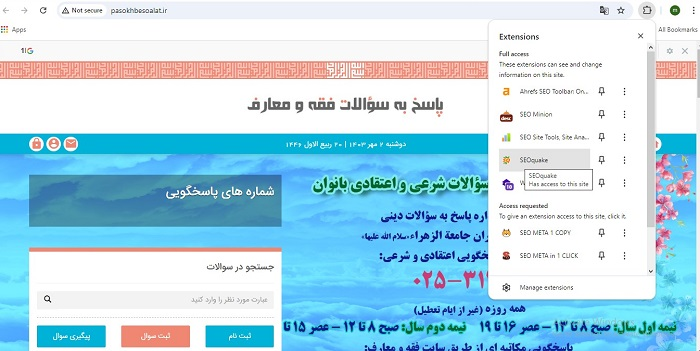
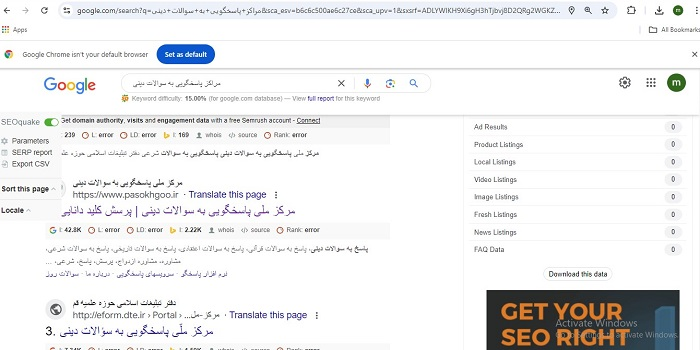
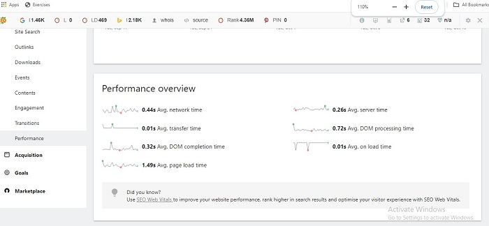

# SEO-BOOK

# مقدمه

هر فرد یا سازمانی که خدمات محتوایی یا فروشگاهی از طریق سایت ارائه میدهد، نیازمند آن است که از عملکرد سایت خود آگاهی کافی داشته باشید.
آنالیز سایت مشخص می کند که تا چه اندازه وب سایت ما پتانسیل رسیدن به اهداف ترافیکی سایت رادارد. و اگر در این زمینه ضعیف عمل کرده است، چطور عملکرد آن را قوت ببخشد.
تحلیل کیفی و کمی  فعالیت سایر رقبا در جهت کسب پیشرفت مستمر، یک نیاز قطعی است. این کار در نهایت به رضایت مخاطبان فعلی و بالقوه ما خواهد رسید و از طرف دیگر شما را به اهداف مان نزدیکتر می سازد. 
در این نوشتار سعی کرده ایم، مفهوم آنالیز، و نحوه کار با ابزارهای آنالیز و تحلیل سایت را توضیح دهیم. 

**منظور از آنالیز سایت چیست؟**

آنالیز سایت فرایندی است که در آن سایت را از نظر سئو تحلیل و بررسی کرده تا بفهمیم آیا سایت به خوبی برای موتورهای جستجو بهینه‌سازی شده یا نه. این فرایند شامل بررسی سئوی داخلی سایت، مباحث تکنیکال سایت و سئو خارجی آن است. در واقع برای آنالیز سایت باید کلیه جنبه‌های سئو مثل عنوان مطالب و تگ‌های متا، کلمات کلیدی هدف، سرعت سایت، فایل سایت مپ، لینک‌سازی داخلی و لینک‌سازی خارجی را بررسی کرده و ببینید در کدام قسمت‌ها به خوبی کار نکرده‌اید و کدام فعالیت‌ها را می‌توانید بهبود دهید.

**هدف از آنالیز سایت چیست؟**
آنالیز سایت این فرصت را در اختیار  ما قرار میدهد تا فرصت های ارتقاء سایت را شناسیی کنیم. در واقع هدف از آنالیز وب سایت این است که نقاط ضعف و قوت آن مشخص شده تا بتوان برای بالابردن رتبه آن در نتایج جستجو تلاش کرد.

# ابزارهای تحلیل
ابزارهای تحلیل، شامل افزونه و نرم افزارهایی هستند که برای وب سایت خودمان و رقبا مورد استفاده قرار می گیرند. هر یک از این ابزارها ویژگی خاص خود مانند مهمترین ویژگی آن، نیاز به اکانت خرید داشتن یانداشتن قابل تقسیم هستند.
در ابتدا به معرفی افزونه ها و آموزش استفاده از آنها خواهیم پرداخت.

## افزونه های تحلیل
افزونه یا اکستنشن، یک قطعه نرم‌افزار یا ماژول کوچک است که به نرم‌افزارها یا مرورگرها امکان افزودن ویژگی‌ها و قابلیت‌های جدید را می‌دهد. این ابزارها به کاربران این امکان را می‌دهند تا تجربه استفاده‌ی خود را به دلخواه شخصی‌تر کنند یا وظایف خاصی را انجام دهند. اکستنش ها بر اساس HTML ، CSS، جاوا اسکریپت ساخته شده‌اند که هر کدام خدمات خاصی را ارائه خواهند داد.
افزونه‌ها طرفداران زیادی دارند و کاربران می‌توانند اقدامات مرتبط با سایت را از طریق افزونه‌های گوگل کروم به بهترین نحو ممکن انجام دهند و مسیر بهینه سازی سایت را راحت‌تر طی نمایند.

### افزونه seoquake

#### معرفی اجمالی

 یک ابزار سئو جهت تحلیل و بررسی وب سایت که قابلیت  سئوی لینک های داخلی و خارجی، کلمات کلیدی و
خطاهای سایت مدنظر شما و میزان صفحاتی ایندکس شده یک سایت درگوگل و بینگ را دارد.
 
#### آموزش نصب

  ابتدا درمرورگر خود SEOquake  را سرچ نمایید و و بعداز ورورد به سایت مربوطه، گزینه Add to chrome را انتخاب نمایید تا به مرورگر شما اضافه شود .
  اSeoquake Chrome Extension دو بخش اصلی را شامل می شود:

**بخش داخلی هر وب سایت**

**صفحه نتایج جستجوی گوگل**
در ادامه می خواهیم در مورد این 2 بخش به طور جزئی و تخصص صحبت کنیم.

#### سئوی بخش داخلی: 
  
 هنگامی که بخواهید یک سایت یا صفحه ای از آن را تحلیل نمایید می توانید آن را درون موتور جستجوی گوگل سرچ کرده و با کلیک بر روی سئوکوئیک از قسمت اکستنشن های کروم یک گزارش کامل از آن سایت را مشاهده نمایید
 با کلیک روز افزونه مورد نظر، تصویر زیر نمایش داده می شود:

 همانگونه که مشاهده میفرمایید اکستنشن سئوکوئیک دارای یک نوار سئو است که شامل 6 بخش می باشد:

 

 هنگامی که روی این بخش کلیک می کنید اطلاعات زیر را به شما نمایش خواهد داد. دقت کنید که این اطلاعات فقط مختص همن صفحه ای می شوند که روی آن کلیک نموده اید نه کل آن سایت.

  - **بررسی title**:

  ازچه عنوانی برای صفحه استفاده شده است

  - **بررسی Meta keywords**:

   تمرکز این صفحه بر روی چه کلماتی است

  -  **بررسی Meta description**:

  چه توضیحاتی مختصری برای نمایش این صفحه در موتور جستجو در نظر گرفته شده است

  - **بررسی internal linK**:

  تعداد لینک های داخلی این صفحه چند تا است. لینک داخلی یا اینترنال لینک به هر لینکی روی وب سایت شما گفته می شود که یکی از صفحات سایتتان را به یکی دیگر از صفحات سایت مرتبط می شود. ( اگر از لینک های نوفالو استفاده شده باشد تعداد آنها را درون پرانتز نشان می دهد. لینک نوفالو (nofollow) به لینکی می‌گوییم که به موتورهای جستجو اعلام شده آن را دنبال نکنند و در نتایج جستجو تاثیری نداشته باشد. یعنی وقتی لینکی به‌صورت نوفالو باشد، موتورهای جستجو اعتباری را برای آن درنظر نمی‌گیرند

  - **بررسی external link**:

  تعداد لینک های خارجی این صفحه چندتا است. لینکهای خروجی ، لینک ‌هایی متعلق وب‌ سایت‌های دیگر هستند که در وب ‌سایت خود قرار می‌دهید و مخاطبان شما از طریق آن‌ها به آدرس ‌های اینترنتی مختلف در سراسر اینترنت وارد می‌شود.
گر این بخش از افزونه Seo Quake را اسکرول کنید و به سمت پایین بیایید با بخشی به نام Keywords density مواجه می شوید که چگالی کلمات این صفحه را نشان خواهد داد. البته این بخش به صورت جداگانه در ابزار سئوکوئیک موجود است که در ادامه به توضیح آن خواهیم پرداخت.
این بخش ارور ها و خطاهای سایت مدنظر شما را بررسی می کند. برای مثال این بخش به شما می گوید از چه تعداد تگ هایی برای عنوان های این صفحه از سایت مدنظر شما استفاده شده است. علاوه بر این می توانید از طریق این بخش بررسی نمایید که اسکیماهایی که برای این صفحه درنظر گرفته شده است به درستی عمل می کنند یا خیر
بخش DIAGNOSIS سایت افزونه سئوکوئیک به شما برای تست فعال سازی تمام مواردی که برای سئو سایت خود نیاز دارید مانند سرچ کنسول، گوگل آنالیتیکس، سایت مپ، Robots.txt نیز کمک خواهد کرد.

  - **بررسی url**:

   بررسی کارکترهای نشانی وب استاندار است یا خیر. تعداد کارکترهای Pasokhbesoalat  استاندارد است

 - **بررسی canonical**:

 تگ کنونیکال (rel=“canonical”) یک قطعه کد HTML است که وقتی در یک صفحه قرار می‌دهید، به گوگل می‌گویید که نسخه اصلی بین صفحات تکراری مشابه کدام صفحه است. 
در واقع تگ Canonical راهی برای کمک به گوگل جهت تشخیص برترین مطلب، میان مطالبی است که شباهت زیادی با هم دارند. به بیان ساده‌تر، زمانی که تگ Canonical یا تگ کنونیکال (همان کد معروف Rel=Canonical) در یک صفحه قرار می‌گیرد، گوگل به آدرسی که این تگ در آن وارد شده است، اهمیت بیشتری می‌دهد و مسلماً آن صفحه را در نتایج جستجو ایندکس می‌کند. 
در وب سایت مثال (پاسخ به سوالات) متاسفانه از تک کنونیکال استفاده نشده است و در آنالیز به عنوان یک هشدار نشان داده می شود.

 

- **بخش meta description**: 

متنی چکیده‌‌ از صفحه مورد نظر است. این گزیده متن، توضیح کاملی درباره محتوای صفحه است که معمولاً در زیر لینک‌های قابل کلیک آبی رنگ در صفحه نتایج موتورهای جستجو (SERP) ظاهر می‌شود.
متا حاوی اطلاعات تکمیلی در مورد جزئیات صفحه است که کاربران با مشاهده آن تمایل بیشتری به کلیک بر روی یک سایت پیدا خواهند کرد. به همبن دلیل یک فاکتور غیر مستقیم برای بالا بردن رتبه و برای افزایش نرخ کلیک در نتایج موتورهای جستجو به شمار می‌‌‌رود. متخصصات سئو تاکید بسیاری بر یونیک بودن و جامع بودن Meta Description ها دارند.

 

 - **بررسی title**:

 تگ Title که به تگ عنوان صفحه یا عنوان سئو هم معروفه، از عناصر و تگ‌های اصلی HTML به حساب میاد. یعنی بدون وجود این تگ، عملا کدهای ما دارای مشکل اساسی است. هر صفه نیاز به یک تایتل دارد.  
در وب سایت مورد بحث یعنی وب سایت پاسخ به سؤالات، کاربربعد از اینکه عبارتی را در  گوگل سرچ میکند، با دیدن عنوان صفحه ما در SERP و مقایسه‌اش با عنوان رقبای ، تصمیم می‌گیرد  وارد کدام سایت شود.  هنگام سرچ در گوگل، کاربر متن نوشته شده در تگ Title را در قالب عناوین سایت‌ها می‌بیند و روی مورد دلخواهش (عنوانی که جذاب‌تراست و با نیاز کاربر تناسب بیشتری دارد) کلیک می‌کند.

 

  - **بررسی headings**:

هدینگ‌ها عباراتی هستند که در ابتدای هر بخش از متن قرار می‌گیرند و توضیح می‌دهند که آن بخش چه چیزی را شرح می‌دهد. استفاده درست از عناوین یا هدینگ‌ها در یک صفحه به ساختار طبقه‌بندی شده‌ متن کمک می‌کند که در نتیجه کاربر و موتور جستجو به سادگی خواهد فهمید که صفحه شامل چه محتوایی است. در واقع کاربر با یک نگاه خواهد فهمید با چه محتوایی روبرو است.
این هدینگ‌ها شش نوع هستند. H1 الی H6. از میان این ۶ مورد، h1، h2 و h3 بیشتر مورد استفاده قرار می‌گیرند. هدینگ‌ها در HTML یک صفحه قرار می‌گیرند.
از h1 به عنوان هدینگ اصلی (main heading) و از هدینگ‌های h2 تا h6 به عنوان عناوین فرعی (subheadings) نام برده می‌شود.
در سایت مورد بحث اخطاری نمایش داده می شود، که برخلاف اجرای هدینگ ها، هدینگ 1 به عنوان تیتر اصلی به کار نرفته است (در واقع فاقد ( main heading و این یک هشدار است که باید اصلاح شود. 

 - **بررسی images**:

تصاویر یکی از راه‌های مؤثر در بهبود سئوی وب‌سایت شما محسوب می‌شوند. استفاده از تصاویر جذاب نه تنها به خوانده شدن مطالب شما توسط کاربر کمک می‌کند، بلکه می‌تواند ترافیک خوبی را نیز به سمت سایت شما روانه کند.

یکی از نکات مهم در بهینه سازی تصاویر سایت، استفاده از ویژگی Alt برای آنها است. تگ Alt و تگ عنوان در تقویت جایگاه مطالب در نتایج موتورهای جستجو و بهبود دسترسی کاربران اینترنتی به وب‌سایت شما تاثیرگذارند. 

در تمام تصاویر به کار رفته در یک وب‌سایت، تگ Alt توصیف‌کننده موضوعی است که از تصویر استنباط می‌شود.
 این تگ می‌تواند به عنوان متنی جایگزین برای تصاویر به هنگام خطا در بارگذاری نیز مورد استفاده قرار گیرد تا کاربران در صورت عدم نمایش تصویر، از مفهوم و عملکرد آن باخبر شوند.
 
 - **بررسی متن به کد (tex to HTML)**:
  
هر سایتی مقدار مشخصی کد نویسی در زیرساخت خود و مقدار مشخصی متن و محتویات در ظاهر داراست. نسبت متن به کد ( Text to HTML ) همان نسبت متن بکار رفته در یک صفحه به کد نوشته شده برای نمایش همان صفحه است.

  - نسبت متن به کد ایده آل چه قدر است؟ 

  
  یک نسبت متن به کد ( Text to HTML ) ایده آل عددی بین 25 تا 70 است. این نسبت مقدار متن آشکار از محتوا به مجموع کد HTML، تصاویر و اطلاعات پنهان در صفحه است. اگر دقت کرده باشید سایت‌هایی که در نتایج گوگل رتبه‌های مناسبی دارند معمولا محتوای قابل مشاهده زیادی در خود دارند. این امر پس از انتشار آپدیت جدید گوگل به اسم پاندا که اهمیت بیشتری برای محتویات سایت‌ها قائل شده است، بیش از پیش جلوه می‌کند.

-  تأثیر نسبت متن به کد در سئو

  در ارزیابی فاکتورهای مربوط به سئو از نظر موتورهای جستجو نسبت متن به کد ( (Text to HTML ) بطور مستقیم تاثیری ندارد ولی بر روی پارامترهای زیادی تاثیرگذار است که می‌توانند نتایج بهتری را برای شما در موتورهای جستجو به همراه داشته باشند. در واقع شما با رعایت نکات زیر تجربه کاربری (UX) سایت خود را بهبود می‌دهید.
این نسبت در وب سایت مورد بحث 60 درصد است که نسبت مناسبی است.

- **نشانه‌گذاری اسکیما چیست؟** (schema.org)

اسکیما مجموعه‌ای از کدهای دسته‌بندی شده، منظم و خلاصه‌ای می‌باشد که ساختار وب‌سایت ما را به موتورهای جستجوگر مثل گوگل، یاهو و ... معرفی می‌کند و باعث می‌شود تا موتورهای جستجوگر بتوانند درک بهتری از محتوای وب‌سایت ما داشته باشند.

استفاده از کدهای schema markup به گوگل کمک می‌کند تا مفهوم محتوای صفحه وب‌سایت ما را به صورت معنایی و کامل متوجه شود. همچنین باعث می‌شود در نتایج جستجو به صورت متمایز از رقبایمان نمایش داده شویم. (پرستاره‌تر، تصاویر بیشتر، بالاتر از بقیه وب‍سایت‌های مشابه و ...)
در واقع وقتی محتوای صفحه را با استفاده از schema markup برای گوگل نشانه دار می‌کنیم، گوگل به راحتی متوجه می‌شود که کلیت این صفحه مربوط به چیست (صفحه محصول، صفحه مقاله و...) و هر قسمت صفحه درباره چه موضوع خاصی صحبت می‌کند. 
وقتی گوگل متوجه معنای صفحه ما شود قطعا درک بهتری از محتوای صفحه ما پیدا می‌کند و در رتبه سایت ما تاثیر گذار است. مثال کاربردی این مطلب در rich snippet و در نتیجه ستاره دار شدن وب سایت در نتایج جستجو کاملا مشخص است. 

  سایت مورد بحث، فاقد اسکیمای مناسب (کدهای دسته‌بندی شده، منظم و خلاصه‌ که بتواند ساختار وب‌سایت  را به موتورهای جستجوگر مثل گوگل، یاهو و ... معرفی کند) است و این یک ارور در آنالیز این وب سایت به شمار می آید.

- **متاتگ خهای شبکه اجتماعی**:
  
  مجموعه‌ای از متاتگ‌هایی هستند ست که به وبمسترها اجازه می‌دهد تا اطلاعات بهینه‌تری از صفحاتخود را به اغلب شبکه های اجتماعی (فیسبوک، گوگل پلای، توییتر، لینکدین و ...) ارائه دهد.
 همانطور که در آنالیز این وب سایت مشاهده میفرمایید، میزان استفاده از این متا تگ ها در این وب سایت مناسب است.

- **بررسی RoboX**: 

از موارد فنی و اصطلاحاً سئوی تکنیکال که برای بهینه کردن ایندکس صفحات سایت به کار می رود، استفاده از فایل robots.txt است. Robots.txt یک فایل متنی است که برای هدایت ربات های موتور جستجو برای نحوه خزیدن و ایندکس صفحات وب سایت استفاده می شود. از آنجا که فایل robots.txt ربات های جستجو را در مورد نحوه خزیدن صفحات مختلف وب سایت شما راهنمایی می کند، دانستن نحوه استفاده و تنظیم این فایل بسیار مهم است. برای جلوگیری از ایندکس شدن صفحات می توان از روش های دیگر مانند تگ noindex استفاده کرد اما زمانی که بخواهید یک دسته از صفحات ایندکس نشوند، نمی توانید برای هر کدام از صفحات به صورت جداگانه از تگ noindex استفاده کنید. در اینجا robots.txt به کمک شما می آید.

اگر یک فایل robots.txt نادرست تنظیم شده باشد، می تواند باعث اشتباه در ایندکس شدن صفحات سایت شود. گاهی اوقات صاحبان سایت ها بعلت نداشتن اطلاعات کافی در این زمینه اشتباهاتی را در ساخت یا ویرایش این فایل متنی رقم می زنند که منجر به خساراتی به سئوی سایت آنها می شود.

وب سایت مورد بحث، این مورد را به خوبی رعایت کرده است. 

- **بررسی XML Sitemapl**
  فهرستی از صفحه‌های موجود در وبسایت است که برای تمامی کاربران قابل دسترس می‌باشد. در همین راستا XML Sitemap نیز فایلی است که مالک وبسایت بوسیله‌ی آن، موتورهای جست‌و‌جوگر را از وجود تمامی صفحه‌های موجود در وبسایتش آگاه می‌کند.

در واقع این فایل موجب معرفی و ثبت آدرس‌های موجود در یک وبسایت، در موتور‌های جست‌وجوگر مانند Google شده و به آن‌ها اعلام می‌کند که یک صفحه‌ی خاص از وبسایت آخرین بار در چه زمانی بروز شده‌ است؛ وبسایت به طور معمول طی چه بازه‌های زمانی بروز می‌شود و همچنین اهمیت یک صفحه از وبسایت‌ را در مقایسه با صفحات دیگر مشخص و تمیز می‌کند.

روی وب، صفحات متفاوت زیادی وجود دارد. اگر مرورگر بداند که صفحه مورد نظر از چه نوعی است، می تواند به درستی آنرا نمایش دهد.

همچنین نسخه های متفاوت زیادی از HTML وجود دارد، و اگر مرورگر نسخه دقیق HTML استفاده شده در صفحه را بداند، می تواند 100% درست آنرا نمایش دهد.

- **بررسی favicon**:

اگر دقت کرده باشید، وقتی بعضی از سایت‌ها را در مرورگرمان باز می‌کنیم، لوگوی سایت روی تب مرورگر نقش می‌بندد. به خصوص وقتی تعداد زیادی تب باز کرده باشیم، چیزی که بیشتر به چشم می‌خورد فقط همین لوگوهاست. این تصاویر چون سریع‌تر از نوشته پیام را به مغز ما مخابره می‌کنند، ما را سریع‌تر از نوشته برای پیدا کردن تب مورد نظر راهنمایی می‌کنند. به این تصاویر روی تب فاوآیکون (favicon) گفته می‌شود. فاوآیکون از دو کلمه مجزای Fav و Icon تشکیل شده است. Fav مخفف کلمه Favorite و Icon به معنای آیکون است.

 

#### لینک های آموزشی:
https://www.aparat.com/v/GBF8c

https://sepidaranweb.ir/seo-quake-extension/

https://elhamkeshavarz.ir/seoquake/

### افزونه SEO META IN 1 CLICK 

#### معرفی اجمالی:
  
  یک ابزار سئو جهت تحلیل و بررسی وب سایت

#### نحوه نصب:

اضافه کردن آن  در قسمت سرچ اکستنشن های کروم  

#### کارکرد ابزار:

ارائه اطلاعات در خصوص عنوان صفحه،  دیسکریپشن،  تعداد تگ‌های H1، H2 و H3، URL ، تگ کنونیکال،  تگ Robots،  تعداد تصاویر بدون متن جایگزین،  تعداد لینک‌ها و... 

#### آموزش نصب افزونه:

برای نصب این افزونه کافی است  ابتدا درمرورگر خود نام افزونه مربوطه   را سرچ نمایید و و بعداز ورورد به سایت مربوطه، گزینه Add to chrome را انتخاب نمایید تا به مرورگر شما اضافه شود .

#### آموزش استفاده از افزونه:

ابتدا وارد سایت که میخواید آنالیز آن را انجام دهید می شوید. سپس افزونه مورد نظر را انتخاب می کنید. اطلاعات این افزونه در شش بخش به شما ارائه می شود. 

- **بخش اول: summary**:

(شامل اطلاعات کلی اعم از عنوان صفحه، توصیفی از خلاصه وب سایت، بررسی تگ ها کونیکال و ...) ارائه می شود. 

- **بخش دوم: هدرها**: 
  
در این قسمت تعداد عناوین هر هدینگ را با عناوین مربوطه را نمایش میدهد. 

- **بخش سوم**:

 
   اطلاعات مربوط به تصاویر به کار رفته شده (همراه با جزئیات عدم استفاده از تگ alt  و تایتل)

- **بخش چهارم**:
  
   اطلاعات مربوط به لینک های به کار رفته شده در صفحه(تعدادکل لینک هآ، لینک های درونی، لینک های بدون عنوان) 

- **بخش پنجم**:
  
social  (تگ‌های OG مجموعه کدهایی هستند که نحوه نمایش آدرس‌های به اشتراک گذاشته شده در شبکه‌های اجتماعی را کنترل می‌کند. در حقیقت این تگ اطلاعات صفحه وب را به‌صورت بهینه در شبکه‌های اجتماعی نظیر فیس‌بوک، توییتر، لینکدین و… نمایش می‌دهد) .

 

#### لینک های آموزشی:

https://www.youtube.com/watch?v=ytyfi8uq8qg

https://www.instagram.com/seoedu/reel/CqKmpisIc9E/

### افزونهWAPPLYZER l

#### شناسنامه افزونه: 

- **تعریف**: 

یک ابزار سئو جهت تحلیل و ارائه محتوای فنی سایت 
 

- **نحوه نصب**: 

سیستم مدیریت محتوای وب سایت ( وردپرس، جوملا، دروپال و … )، ابزارهای گوگل ( فونت، جیمیل، آنالیتیک و …)
زبان برنامه نویسی سایت ( PHP و گراواتار (Gravatar)، اسکریپت فروشگاه های اینترنتی، جاوا، جاوا اسکریپت، جی کوئری

##### آموزش نحوه نصب افزونه 

برای نصب این افزونه کافی است  ابتدا درمرورگر خود نام افزونه مربوطه   را سرچ نمایید و و بعداز ورورد به سایت مربوطه، گزینه Add to chrome را انتخاب نمایید تا به مرورگر شما اضافه شود .

افزونه Wappalyzer با تجزیه و تحلیل کدهای HTML در صفحه ی مورد نظر تشخیص میدهد که از چه سیستم مدیریت محتوائی ( CMS ) و یا نرم افزار تجارت الکترونیک ( e-Commerce ) یا سیستم پیام ( Message Board ).. استفاده کرده است. تمرکز Wappalyzer در واقع روی نرم افزارهای قابل دریافت مانند جوملا، وردپرس و .. است، اما در کنار آن نیز سیستم‌های عمومی مانند بلاگر و .. را نیز اضافه کرده است. زمینه فعالیت این افزونه analytics, blogging, CMS, e-commerce, image gallery, JS framework, message board, widget, wiki میباشد.

##### لینک های آموزشی:

https://3dupstudio.net/wappalyzer/

https://www.youtube.com/watch?v=lV4mww-BhSg

https://www.aparat.com/v/s3840x6

 https://digitalmentorx.com/blog/what-is-the-wappalyzer-plugin-and-what-is/ 

## پلتفرم/ نرم افزار های تحلیل : 
پلتفرم های تحلیل با هدف بررسی دقیق و بهبود سئوی سایت طراحی شده اند. برای استفاده از برخی از این پلتفرم ها / سایت ها نیاز به خرید اکانت و گاهی مالکیت سایت دارد.
چگونه فایل ها را راست به چپ کنیم؟

### سایت semrush: 

#### شناسنامه semrush 

- **نوع ابزار**:

پلتفرم نرم افزار به عنوان سرویس با تخصص در جستجوی کلمات کلیدی

- **کارکرد**:

تحلیل رقبا و بهینه‌سازی کمپین‌های تبلیغاتی

- **نوع ابزار**: 

پلتفرم نرم افزار به عنوان سرویس با تخصص در جستجوی کلمات کلیدی

- **نحوه نصب**:
خرید اکانت و استفاده از وب سایت سمراش

#### آموزش استفاده از ابزار سمراش: 

##### پنل Domain Overview 
 

بخش Domain Overview برای وارد کردن دامنه دلخواه و بررسی آن با سایت های مشابه است که شامل موارد زیر می باشد:

- **بخش Authority Score:**
- 
 اعتبارآن دامنه را در اختیار ما می گذارد. این مقدار اعتبار توسط ابزار سمراش به هر دامنه ای داده می شود که هرچقدر این مقدار عددی بیشتر باشد یعنی آن دامنه ار اعتبار بیشتری برخوردار است.

در مثال ما، اعتبار سایت جامعه الزهرا«علیهاسلام» 22 است. 

- **بخش Organic Search Traffic**:

میزان بازدید سایت و روند آن را نشان می دهد

- **بخش Paid Search Traffic**: 
 
 این قسمت از ابزار Semrush بازدیدهایی که از طریق گوگل ادورز(تبلیغات گوگل) به دست می آید را نشان می دهد. 
 
 - **بخش Backlinks**: 

در این قسمت دامنه هایی که به سایت مدنظر شما لینک داده اند و نوع لینک ها اعم از فالو یا نوفالو را مشاهده می کنید. در واقع تمامی اطلاعاتی که برای بک لینک های یک سایت نیاز است را می توانید از این بخش دریافت نمایید.

##### پنل بعد شامل موارد ذیل است:

ا Distribution by Country: میزان ترافیک سایت بر اساس کشورهای مختلف را نشان می دهد.

ا Organic Traffic: میزان ترافیک ارگانیک را به شما نشان می دهد.

ا SERP Features: کلمه هایی که در زمان های مختلف دارای رتبه هستند را بر اساس نموداری نشان می دهد.

ا Organic Keywords: میزان رتبه ی کلمات کلیدی را در زمان های مختلف بررسی می کند.

##### پنل سوم شامل موارد ذیل است:

اTop Organic Keywords: وقتی شما به سمت پایین می آیید(اسکرول می کنید) با قسمتی به نام Top Organic keywords روبرو می شوید که به شما می گوید سایت مدنظرتان از چه کلمات کلیدی بازدید بیشتری را دریافت می کند.

اMain Organic Competitors: در قسمت پایین تر با جدولی به نام Main Organic Competitorsروبرو می شوید که این جدول سایت هایی که محتوا و موضوعاتی مانند سایت مدنظر شما دارند را نشان می دهد و شما در این قسمت می توانید این سایت را تحلیل و بررسی نمایید

اTop Anchors: برترین و بهترین انکرتکست (متن یا عبارتی که با کلیک بر روی آن از یک مقصد به مقصدی دیگر منتقل می شوید، این عبارت دو مکان مختلف در اینترنت را به یکدیگر متصل می کند) که باعث دریافت لینک های بیشتری برای شما شده است را نشان می دهد.

اIndexed Pages: صفحاتی از سایت مورد نظر شما که ایندکس شده اند را نشان می دهد.

بعد ازبررسی موارد بالا وارد بخش Traffic Analytics سمراش می شویم. اگر می خواهید گزارش کاملی از این بخش دریافت کنید باید نسخه ی پریمیوم(پولی) سمراش را دریافت کنید. نسخه ی رایگان سمراش میزان بازدید های ماهانه سایت شما را در این بخش نشان می دهد.

این بخش میزان ورودی هر صفحه از سایت (از طریق گوگل و دیگر موتور های جستجو یا لینک ها)، میزان ماندگاری کاربر در هر صفحه، نرخ پرش( بانس ریت) و … را نشان می دهد.

##### پنل Traffic Analytics:

بعد ازبررسی موارد بالا وارد بخش Traffic Analytics سمراش می شویم. اگر می خواهید گزارش کاملی از این بخش دریافت کنید باید نسخه ی پریمیوم(پولی) سمراش را دریافت کنید. نسخه ی رایگان سمراش میزان بازدید های ماهانه سایت شما را در این بخش نشان می دهد.

این بخش میزان ورودی هر صفحه از سایت (از طریق گوگل و دیگر موتور های جستجو یا لینک ها)، میزان ماندگاری کاربر در هر صفحه، نرخ پرش( بانس ریت) و … را نشان می دهد.

##### پنل Organic research
بخش Organic research سمراش که سومین بخش نوار سئو این ابزار می باشد، دو قسمت مهم به نام های top organic keywords و top page دارد که اطلاعات بسیار مفیدی را در اختیار ما می گذارند.

بخش top organic keywords: این قسمت بهترین کلمات کلیدی هر سایت را در اختیار ما می گذارد و به ما می گوید چه کلماتی باعث شده تا سایت مدنظر ما از ترافیک بالاتری برخوردار شود.

اگر می خواهید لیستی از این کلمات را برای خود ذخیره نمایید کافی است تا روی export کلیک کرده تا سمراش خروجی از این کلمات را به صورت ورد یا اکسل در اختیار شما بگذارد. 

برای مثال همانطور که در تصویر زیر مشاهده می کنید کلماتی که باعث شده تا سایت Moz از ورودی بیشتری برخوردار شود سئو، ماز، گوگل آنالیتیکس و… می باشد. در این قسمت با کلیک بر روی View all organic keywords می توانید تمام کلمات کلیدی که باعث پیشرفت یک سایت شده اند را مشاهده نمایید.

•	اtop page : صفحاتی که بالاترین میزان ورودی را داشته اند یا برای کاربران بسیار مفید بوده اند و باعث شده تا کاربران زیادی به این صفحات وارد شوند را نشان می دهد.

##### پنل keyword Gap

•	پس از عبور از بخش بالا وارد بخش keyword Gap می شویم. با استفاده از این بخش می توانید کلمه های کلیدی سایت خود و رقیبتان را با یکدیگر مقایسه نمایید و میزان ترافیک از هر کلمه کلیدی را به دست آورید. در این باره در ادامه اطلاعات بیشتری را در اختیار شما قرار می‌دهیم.

 ##### پنل Backlink Gap

•	در این بخش همانطور که از نامش پیدا است اطلاعاتی از بک لینک های هر سایت مانند سایت هایی که به سایت مورد نظر ما لینک داده اند و میزان ورودی از هر بک لینک را نشان می دهد. همچنین این بخش به شما می گوید که از کدام کلمه کلیدی که استفاده کرده اید بک لینک بیشتری دریافت نموده اید.

آشنایی با بخش Keyword research
شاید بخواهید قبل از نوشتن یک مقاله و یا قبل از سئو سایت خود بدانید رو چه کلمه‌هایی کار کنید تا میزان ترافیک سایت خود را بالا ببرید. این بخش از ابزار آنلاین سمراش به شما برای یافتن کلمه کلیدی مدنظرتان کمک خواهد کرد. اما این مورد را بخاطر داشته باشید که به علت تحریم‌ها، اطلاعاتی که این ابزار برای زبان فارسی نشان می‌دهد دقیق نیست و احتمالا این آمار، بسیار کمتر از مقدار واقعی می‌باشد.

بخش های این قسمت عبارتند از:
•	اkeyword overview: با کلیک بر روی این بخش می توانید هر کلمه کلیدی که می خواهید را وارد کرده تا میزان موفقیت از هر کلمه کلیدی و میزان سرچ آن را مشاهده نمایید. بنابراین با استفاده از این بخش از سمراش، می توانید تصمیم بگیرید که روی کدام کلمه وقت زیادی بگذارید. برای مثال همانطور که در تصویر زیر مشاهده می کنید ما در این قسمت سه کلمه به دلخواه خود وارد کرده ایم.

•ا	Position tracking: در این بخش می توانید دامنه سایت یا صفحه مورد نظر خود را وارد کنید تا جایگاه آن را مشاهده نمایید. در واقع این بخش نمایی شبیه به نمودار سرچ کنسول دارد و بازدید های روزانه سایت مدنظر شما را در اختیارتان می گذارد.

•	اOrganic Traffic Insights: این بخش به شما می گوید در اثر نتایج سرچ کاربران سایت شما چندبار توسط موتورهای جستجو نمایش داده شده و باعث شده تا از این طریق از ترافیک بالایی برخوردار شوید دو چه کلمات سرچ شده ای باعث نمایش شما توسط موتور های جستجویی مانند گوکل شده است.

##### پنل Link Building بک‌لینک‌های ابزار سمراش

این بخش دارای قسمت‌های زیر است:

•اBacklink Analytics: در این بخش میتوانید پس از وارد کردن آدرس سایت مدنظر خود، تمام اطلاعاتی که نیاز دارید برای بک‌لینک‌های یک سایت بدانید را مانند تصویر زیر مشاهده نمایید. برای مثال می‌توانید در بخش Overview یک اطلاعات کلی از اینکه آن سایت چه تعداد بک‌لینک، کلمه کلیدی‌هایی که باعث رشد آن سایت می‌شوند و… را مشاهده کنید. یا در بخش Backlink تمامی بک‌لینک‌ها را به صورت لیست دریافت نمایید، در بخش Anchors، انکرتکست‌های آن سایت را مشاهده کنید.

•اBulk Backlink Analysis: در این بخش می‌توانید لیست رقبای خود را وارد نمایید تا مشاهده کنید که چه نعداد بک لینک دارند، چندتا از بک‌لینک‌های آنها به صورت تصویر، متن و…. هستند یا چه تعداد بک‌لینک فالو و نوفالو دارند. این قسمت کمک زیادی به بررسی بک‌لینک‌های سایت رقبایتان می‌نماید و میتوانید با کلیک بر روی گزینه Export، یک لیست از این اطلاعات را دریافت نمایید.

اگر می خواهید ببینید رقیبانتان با نوشتن چه مقالاتی رتبه بالاتری گرفته اند یا چه مقالاتی باعث شده تا آنها میزان کاربران بیشتری را جذب سایت خود کنند کافی است به قسمت Content Marketing سمراش رفته و با وارد کردن آدرس سایت رقیبتان، مقالات برتر آن را مشاهده نمایید.

علاوه بر این می توانید در قسمت Question این بخش، سوالاتی را که کاربران در موتور جستجو وارد کرده و وارد مقاله های سایت رقیب شما شده اند را مشاهده نمایید تا بتوانید از آن سوالات برای عنوان های مقالات خود استفاده نمایید تا کاربر پس از سرچ کردن عبارات مورد نیاز خود در موتورهای جستجو به سرعت وارد سایت شما شود.
 

-**چگونه نزدیکترین رقیب خود را با استفاده از سمراش بشناسیم؟** 

پس از وارد کردن آدرس سایت خود در قسمت Domain Overview با نموداری مانند تصویر زیر روبرو می شوید. این دایره ها رقیب های شما هستند که بزرگترین آنها رقیب اصلی شماست و شما باید آن را در ابزار سمراش آنالیز نمایید تا نتواند از شما پیشی بگیرد

### سایت Matomo   

#### معرفی اجمالی: 

ماتومو(Matomo) مجموعه ای از همه ابزارها و امکاناتی است که شما می‌توانید با گوگل آنالیتیکس و سایر ابزارهای مشابه مقایسه کنید. 

این ابزار ضمن اینکه به شما تجزیه و تحلیل آماری وب سایت را ارائه می‌دهد، می‌تواند به شما Heatmap فعالیت کاربران و در عین حال نکات مهم در بررسی SEO وب سایت را نیز ارائه بدهد. 

شما با استفاده از این ابزار می‌توانید یک دید بسیار عالی برای بازاریابی وب سایت خود پیدا کنید. ماتومو برعکس گوگل از دیتای کاربران شما استفاده تجاری نمی‌کند. Matomo یک سرویس متن باز و رایگان است که امکانات رایگان آن برای حجم وسیعی از کسب و کارها کفایت می‌کند و بنابراین از این نظر با گوگل آنالیتیکس قابل مقایسه است.
در واقع Matomo Analytics را در حال حاضر می‌توان بهترین رقیب گوگل آنالیتیکس دانست و سرویس‌های دیگر هنوز نتوانستند به این رقابت نزدیک شوند.

سایر امکاناتی که در Matomo در اختیار دارید، عبارتند از:
•	پروفایل بازدیدکننده ها
•	هیت مپ ها با نقشه های حرارتی (برای بررسی قسمت های محبوب تر سایت)
•	مدیریت تگ ها به عنوان یک Tag manager
•	تست  A/B
•	ارائه گزارش موتور جست و جو
•	و … .

لازم به ذکر است که این ابزار با قانون GDPR سازگار است.

قانون GDPR که مخفف General Data Protection Regulation  است به معنی مقررات محافظت از داده های عمومی است. طبق این قانون هر کمپانی که به اطلاعات کاربران دسترسی دارد، حق کپی رایتی نسبت به آن اطلاعات ندارد. بنابراین اجازه استفاده از آنها و یا فروش آنها به سایر ابزارهای یا سازمان ها را نخواهد داشت.
ماتومو دارای طیف وسیعی از ویژگی ها است که به شما کمک می کند تا رفتار کاربران خود را به طور عمیق درک کنید. برخی از مهم ترین ویژگی های این ابزار عبارتند از:

•	نقشه گرمایی (Heatmap): نقشه گرمایی به شما نشان می دهد که کاربران روی کدام قسمت های سایت شما کلیک می کنند، می رانند و می گذرانند. ا

ین اطلاعات به شما کمک می کند تا عناصر سایت خود را که بیشترین توجه را به خود جلب می کنند شناسایی کنید.

•	گزارش ها (Reports): ماتومو طیف وسیعی از گزارش ها را ارائه می دهد که به شما کمک می کند تا عملکرد سایت خود را از جنبه های مختلف ارزیابی کنید.

•	ادغام با سایر ابزارها (Integrations): ماتومو با سایر ابزارهای محبوب مانند وردپرس، جوملا و ووکامرس ادغام می شود. این ادغام ها به شما کمک می کند تا داده های ماتومو را با داده های سایر ابزارها به راحتی ترکیب کنید.

ماتومو برای انواع کسب و کارهای اینترنتی از جمله فروشگاه های آنلاین، وب سایت های خبری، وب سایت های آموزشی و غیره مناسب است. این ابزار به شما کمک می کند تا تجربه کاربری (UX) سایت خود را بهبود ببخشید و نرخ تبدیل خود را افزایش دهید.

بهترین جایگزین گوگل آنالیتیکس
این سرویس نه تنها در ایران در دسترس است بلکه دشواری‌های کار با گوگل آنالیتیکس را هم ندارد. این ابزار از قابلیت‌های بسیار زیادی بهره می‌برد که بدون اغراق می‌توان گفت اغلب قابلیت‌های سرویس گوگل در این سرویس نیز وجود دارد. شما با یک داشبورد حرفه‌ای طرف هستید که می‌توانید ویجت‌های دلخواهی را از مجموعه ده‌ها ویجت به آن اضافه کنید که هر کدام از آن‌ها اطلاعات خاصی را نمایش می‌دهند. مثلا شما می‌توانید ویجت نمای کلی بازدیدها را در کنار بازدید لحظه‌ای و گزارشات آماری و نقشه در بالای پیشخوان‌تان قرار دهید. هر کدام از این ویجت‌ها قابلیت شخصی‌سازی بسیار مفیدی دارند. مثلا نمای ویجت مربوط به نمودار بازدیدهای هفته را تغییر دهید و یا بازه زمانی آن را عوض کنید.

در کنار این داشبورد که نمای کلی و خلاصه وضعیت از آمار سایت را به شما نشان می‌دهد یک سایدبار هم وجود دارد که دسترسی شما را به بخش‌های پیشرفته و حرفه‌ای برقرار می‌کند. شما در این سایدبار می‌توانید به بازدیدها، مراجع ترافیک، گزارش موتورهای جستجو، وضعیت کمپین‌های تبلیغی، گزارشات مربوط به تجارت الکترونیک و فروش‌ها، کلمات کلیدی، اهداف و ده‌ها بخش دیگر دسترسی داشته باشید.
##### پنل Overview

اMatomo به شما یک نمای کلی از بازدیدکنندگان ارائه می دهد تا به شما در درک محبوبیت سایت خود کمک کند.با Overview، می توانید تصویر واضح تری از تجربه هر بازدیدکننده در یک نگاه و در زمان واقعی دریافت کنید مثل مکان بازدیدکنندگان، دستگاه‌هایی که استفاده می‌کنند، نرم‌افزار، زمان‌های روز، گروه‌های مختلف کاربران، و به‌صورت اختیاری شناسه‌های کاربر و ابعاد سفارشی را بررسی کنید.

به عنوان مثال در سامانه پذیرش جامعه الزهرا«سلام الله علیها»:
-	162 بازدید و 136 بازدید انحصاری(Unique Visitors)
-	میانگین مدت زمان ویزیت: 2 دقیقه و 42 ثانیه
-	38درصد از بازدیدکنندگان پس از مشاهده یک صفحه، وب سایت را ترک کرده اند.
-	میزان اقدام (دانلود، کلیک روی لینک ها): 4.2
-	حداکثر میزان اقدام در یک بازدید:57
-	523 بازدید از صفحه، 284 بازدید منحصر به فرد از صفحه 
-	کل جستجو در وب سایت:0
-	 کلمه کلیدی منحصر به فرد: 0
-	76 دانلود و 60 دانلود منحصر به فرد 
-	79 لینک خروجی، 59 لینک منحصر به فرد

##### پنل Behaviour

ابزار Matomo بسیاری از اقدامات بازدیدکنندگان شما مانند بازدید از صفحه، کلیک بر روی فایل ها (دانلودها)، کلیک بر روی لینک ها (Outlinks)، مشاهده و کلیک بر روی بلوک های محتوای خاص با ردیابی محتوا را اندازه گیری می کند. حتی می توانید رویدادهای سفارشی را پیاده سازی کنید و عملکرد صفحه را پیگیری کنید

##### پنل SEO Web Vitals

ابزار Matomo شما را قادر می سازد تا معیارهای SEO Web Vitals را ردیابی کنید. مواردی مانند سرعت صفحه وب سایت شما و عملکرد بارگذاری هستند که می توانند به بهینه سازی موتورهای جستجو کمک کنند. موتورهای جستجو نمی‌خواهند افراد را به صفحه‌هایی بفرستند که به‌نظر می‌آیند آشفته‌اند و بارگذاری آن‌ها برای همیشه طول می‌کشد و به اعتبار آن‌ها منعکس می‌شود.
بنابراین، این موارد حیاتی وب بیشتر و بیشتر توسط موتورهای جستجو مانند Google برای رتبه‌بندی وب‌سایت‌ها و تضمین تجربه، صفحات عالی برای کاربرانی که به پیوندهایی از نتایج خود می‌رسند، استفاده می‌شوند.

##### پنل Users Flow
با Users Flow، متوجه می شوید که بازدیدکنندگان یا کاربران شما در وب سایت یا برنامه شما کدام مسیرها را طی می کنند. اشکالات را پیدا کنید و بخش‌هایی از وب‌سایت یا برنامه‌تان را پیدا کنید که کاربران شما در آن گیج می‌شوند.
بر اساس این اطلاعات می توانید وب سایت یا برنامه خود را بهبود بخشید تا تبدیل و فروش خود را افزایش دهید.

##### پنل Real-time reports
ابزار Matomo گزارش های تحلیلی وب را در زمان واقعی ارائه می دهد. وقتی داده‌هایی را برای «امروز» یا «ماه جاری» یا هر محدوده تاریخی از جمله امروز درخواست می‌کنید، گزارش‌ها شامل آخرین بازدیدها می‌شوند و تضمین می‌کنند که همیشه به داده‌های تحلیلی به‌روز دسترسی دارید. به‌طور پیش‌فرض، گزارش‌ها هر 10 ثانیه پردازش می‌شوند، اما می‌توانید این تأخیر را در صفحه «تنظیمات عمومی» مدیریت سفارشی کنید.

### ابزار  GTmetrix

#### پنل GTmetrix Grade

این امتیاز یک ارزیابی از کارایی کلی سایت شما می دهد که شامل یک گرید است و از A شروع می شود و امتیازات زیر را به شما نشان می دهد.

اperformance: عملکرد سایت شما را به درصد نشان می دهد و بر اساس الگوریتم لایت هاوس اندازه گیری می شود.

ا structure: ساختار سایت شما را بررسی کرده و بر اساس درصد به ساختار آن امتیاز می دهد.
اWeb Vitals (هسته حیاتی گوگل):

هسته حیاتی گوگل مجموعه معیارهایی است که به شما می گوید کاربران چگونه با وب سایت تان تعامل کرده و آن را تجربه می کنند. به عبارت دیگر نشان می دهد سایت شما چقدر سریع به کاربران تان ارائه می شود. هسته حیاتی گوگل شامل سه معیار است که هرکدام نشان دهنده یک بخش از تجربه صفحه توسط کاربر است. برای تحلیل سایت با جی تی متریکس درک این سه معیار ضروری است

•ا	Largest Contentful Paint (LCP)
LCP به شما میگوید که چه مدت طول می کشد تا بزرگترین عنصر محتوایی (به عنوان مثال یک تصویر اسلایدر یا تیتر اصلی) در صفحه شما برای بازدید کنندگان قابل نمایش و رویت باشد. در واقع مدت زمانی را نشان می دهد که بزرگترین بخش محتوای شما قابل نمایش است. برای مثال یک تصویر بزرگ دارید که ممکن است نمایش آن بیشتر از بقیه المان ها بیشتر زمان ببرد. این زمان هر چه پایین تر باشد بهتر است و تجربه کاربری بهتری را منتقل می کند. برای داشتن یک تجربه کاربری عالی، باید LCP کوچکتر یا مساوی با ۱.۲ ثانیه باشد.
•	اTotal Blocking Time (TBT)
یکی دیگر از معیارهای مهم در آموزش GTmetrix معیار TBT است که مدت زمانی را نشان می دهد که طول می کشد در هنگام بارگذاری سایت شما کاربران قادر به انجام کاری نباشند و سایت شما توسط اسکریپت ها مسدود باشد. در واقع قابل استفاده بودن سایت  را در حین بارگذاری نشان می دهد.
•ا	Cumulative Layout Shift (CLS)
امتیاز CLS میزان تغییرات سایت شما را در هنگام لود شدن سایت نشان می دهد. این امتیاز نیز هر چه پایین تر باشد بهتر است. بعضی مواقع در هنگام بارگذاری سایت، المان های صفحه جابجا می شوند. این عناصر می توانند تصاویر، دکمه های تماس، فونت ها و غیره باشند.
1- سربرگ Summerry جی تی متریکس
اولین سربرگ تحلیل سایت با جی تی متریکس که به تازگی به این ابزار اضافه شده است، صفحه را از نظر عملکرد، ساختار و رفتار بارگذاری، سرعت و مشکلات احتمالی بررسی می کند. از اطلاعاتی که در این سربرگ نشان داده می شود شما به تنهایی می توانید اقدامات اصلی را برای بهبود سرعت سایت خود انجام دهید. این سربرگ از سه بخش Speed visualization، Top Issues و page details تشکیل شده است. در بخش اول شما می توانید سرعت لود سایت را تصویری ببینید و تجربه کاربر را از هنگام ورود به صفحه و بارگذاری صفحه مشاهده کنید.

#### پنل Performance 
در این بخش از آموزش تحلیل سایت با GTmetrix، سربرگ Performance را به طور کامل بررسی می کنیم. این امتیاز عملکرد کلی سایت و نحوه اجرای صفحات آن را نشان داده و با استفاده از الگوریتم لایت هاوس بررسی را انجام می دهد. همان عددی است که در بخش GTmetrix Grade به شما نشان می دهد و بین 0 تا 100 است.
بخش performance، مقدار 70 درصد از نمره نهایی جی تی متریکس را تشکیل می دهد. بخش ابتدایی این سربرگ 6 معیار را نشان می دهد که 3 تای آن را در بخش core web Vitals توضیح دادیم. در ادامه هر 6 معیار امتیازدهی سایت در جی تی متریکس را با روش های بهبود آنها آورده ایم.

  اFirst Contentful Paint: معیار FCP زمان اولین محتوایی است که کاربر می تواند در صفحه ببیند. این امتیاز معیار خوبی برای سنجش سرعت است.
✔️ روش های بهبود: استفاده از CDN، استفاده مناسب از کش، عدم انجام ریدایرکت های پی در پی، کاهش حجم صفحه و تعداد درخواست های ارسالی به سرور .
Largest Contentful Paint: در بخش قبل درباره LCP مفصل توضیح دادیم و گفتیم که زمان نمایش بزرگترین محتوای صفحه است.
✔️ روش های بهبود: بهینه سازی نیمه بالایی صفحه، (بزرگترین محتوا را در سربرگ structure و قسمت Largest Contentful Paint Element می توانید ببینید). تگ های img، video و غیره می توانند بزرگترین محتوای صفحه محسوب شوند. یکی از موارد بهینه سازی این بخش ترکیب عکس ها با متد CSS Sprites، استفاده از فرمت های جدید برای تصاویر مانند jpg XR و فرمت ویدیویی مناسب به جای GIF،
🔸 Speed Index: معیار SI در آموزش GTmetrix نشان می دهد که نیمه بالایی سایت ما یا همان above the fold چقدر سریع لود می شود. بخشی که بدون اسکرول در همان وهله اول توسط کاربر قابل مشاهده است. این معیار 15 درصد از امتیاز performance را دارد و نمایش محتوا را از نظر بصری بررسی می کند. مقدار آن بهتر است 1.3 ثانیه یا حداکثر 1.7 ثانیه باشد. این معیار به اندازه و نوع مرورگر وابسته است.
✔️ روش های بهبود: کاهش زمان اجرای فایل های JavaScript، حذف فایل های JS بدون استفاده و بهینه سازی کتابخانه ها JS
Time to Interactive: معیار TTI برخلاف SI کارکردی است و واکنشگرایی صفحه را در هنگام لود شدن بررسی می کند. زمان تعامل، مدت زمانی است که طول میکشد تا کاربر بتواند با صفحه تعامل داشته باشد. مقدار آن کمتر از 2.5 ثانیه خوب است و تا 3.2 ثانیه قابل قبول است.
✔️ روش های بهبود: پیش بارگذاری درخواست های اصلی و مهم، کاهش تعداد درخواست ها، کاهش زمان اجرای فایل های JS
Total Blocking Time: مجموع زمان بلاک شدن یا همان TBT که در بخش قبل هم توضیح دادیم، مدت زمان جابجایی المان ها را در حال لود شدن نشان می دهد.
✔️ روش های بهبود: بهینه سازی عملیات پشت صفحه مانند تجزیه فایل های CSS و اجرای فایل های JS
Cumulative Layout Shift: معیار CLS میزان تغییرات سایت شما را در هنگام لود شدن سایت نشان می دهد. معیار پایداری المان های صفحه است. تا 0.1 خوب و تا 0.15 قابل قبول است.
✔️ روش های بهبود: مواردی که باعث شیفت در صفحه می شوند مثل آی فریم ها یا تبلیغات را به انتهای صفحه منتقل کنید، فونت سایت در انتها لود شود، توجه ویژه به سرعت لود انیمیشن ها و غیره.
توجه کنید که در تحلیل سرعت سایت با جی تی متریکس معیارهای LCP و TBT بیشترین تاثیر را روی performance دارند. لایت هاوس در Gtmetrix جدید بسیار سخت گیرانه عمل می کند. اگر سایت شما امتیازات بالایی در این بخش ندارد پس خیلی نگران نباشید. برای بهبود سرعت می توانید روی معیارهایی که بیشتر تاثیر را در سرعت سایت شما دارند مانند LCP کار کنید. مثلا با توجه به اینکه LCP زمان نمایش بزرگترین محتوای صفحه است، اگر اسلایدر دارید می توانید از یک اسلایدر سبکتر یا تنها از تصویر استفاده کنید.
3- سربرگ Structure جی تی متریکس
سربرگ دیگری که در تحلیل سرعت سایت با Gtmetrix می بینید، Structure است که ساختار کلی سایت شما را ارزیابی می کند و بر اساس الگوریتم PX عمل می کند. این بخش همان سربرگ های PageSpeed و YSlow در الگوریتم قبلی Gtmetrix است. بخش ساختار، 30 درصد امتیاز جی تی متریکس را به خودش اختصاص داده است. برچسب impact در این بخش به تازگی اضافه شده است که برچسب ها از high شروع می شوند و به N/A می رسند و به همین ترتیب اهمیت خطا در سایت شما را نشان می دهند. اگر مواردی که برچسب High دارند را بهبود بدهید این مساله باعث بهبود اساسی در عملکرد سایت شما می شود. برای مثال N/A فقط در حد اطلاع رسانی است و تاثیر چندانی در عملکرد سایت شما ندارد.
سربرگ Waterfall 
این سربرگ اطلاعات ارزشمندی درباره عملکرد سایت ارائه می دهد و تحلیل اطلاعات این بخش قدری مشکل است. 5 ستون در این قسمت وجود دارد که نشان می دهند چه ریکوئست ها و درخواست هایی توسط کاربر از وبسایت شما دریافت می شود و یا چند ثانیه طول می کشد تا هر درخواست بارگذاری شود.

Seobility 

ک ابزار رایگان برای بررسی دقیق سئو وب سایت است. با کمک این ابزار، شما می توانید عملکرد وب سایت خود را بر اساس دستورات و توصیه های سئو روز دنیا، بسنجید. برای استفاده از این ابزار، کافی است آدرس URL وب سایت خود را به این آنالیزور بدهید تا گزارش کاملی را به همراه توصیه هایی برای بهینه سازی شرایط وب سایت خود، دریافت کنید. با کمک این ابزار علاوه بر بررسی دقیق سئوی وب سایت، شما می توانید به بیش از 1000 ممیزی فرعی برای صفحه ها، گزارش ایمیل ها، هشدارها و نظارت بر کلمات کلیدی نیز دسترسی داشته باشید.
•	پیدا کردن خطاهای فنی: برای بازیابی ترافیک از دست رفته و جلوگیری از کاهش ترافیک در آینده، مشکلات سئوی صفحه را به سرعت حل کنید.
•	امتیازدهی دقیق SEO: امتیاز سئو وب سایت را با در نظر گرفتن فاکتورهای مختلف، از جمله متا داده ها، کیفیت صفحه، ساختار پیوند و موارد دیگر بسنجید.
•	تجزیه و تحلیل اطلاعات متا: مشکلات خاص SEO را با اطلاعات متا وب سایت مانند عناوین/توضیحات متا، متا تگ ها و نام های دامنه با URL های نامعتبر یا نادرست صفحه ها حل کنید.
•	بهینه سازی فرصت ها: پتانسیل های بهبود وب سایت خود در زمینه های سرعت و کیفیت را شناسایی کنید (مرتبط با متن، محتوای تکراری، طراحی جذاب و ویژگی های alt برای محتوا).
•	پیشنهادات ساختار پیوند: بهبود بخشیدن به صفحه و ساختار پیوندها بر اساس داده‌های مربوط به سرصفحه‌ها، پیوندهای داخلی و متن های لنگر نادرست.
•	رفع خطاهای سرور: خطاهای خاص سرور مربوط به هرگونه تغییر مسیر، هدر HTTP یا فایل های CSS و جاوا اسکریپت را شناسایی کنید.

- معرفی افزونه ها 

- seo quake 

  - افزونه های رایگان 

  - افزونه seo 

- سایت ها

  ا- ۱. Flutter Team Samples: مجموعه‌ای از نمونه‌های رسمی تیم Flutter شامل پروژه‌های ساده و پیچیده (مثل نقشه‌ها، انیمیشن‌ها و ابزارهای Material و Cupertino).

ا- ٢. 
